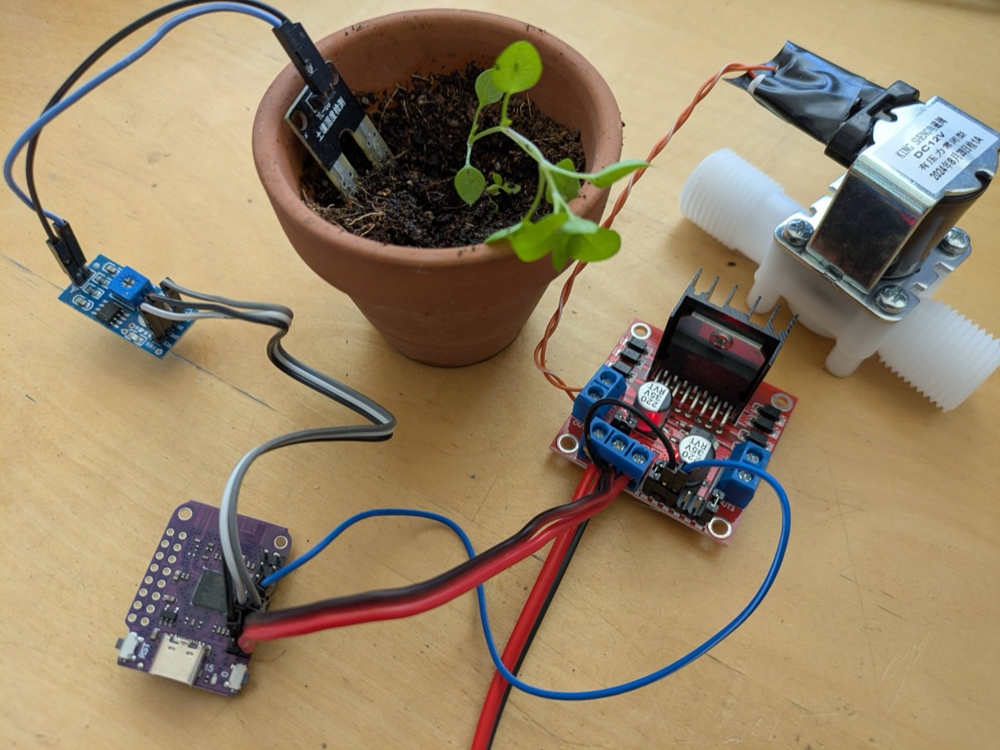
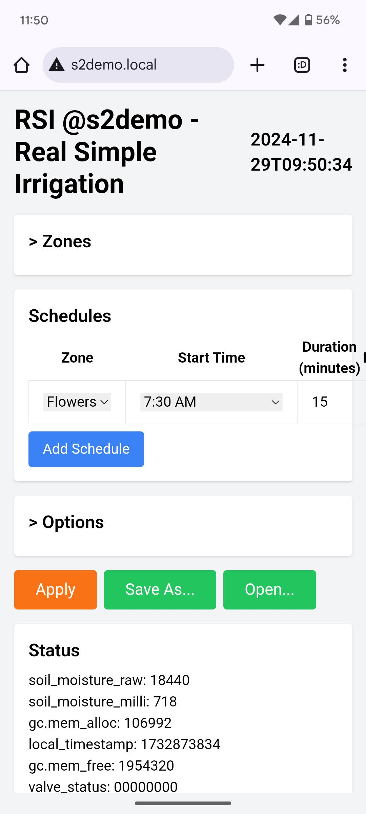
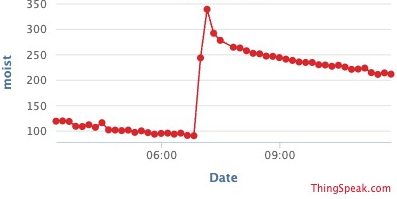
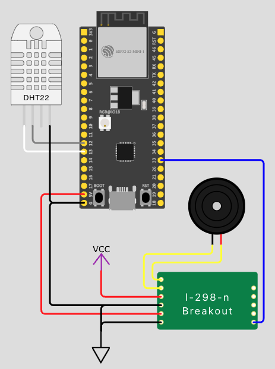
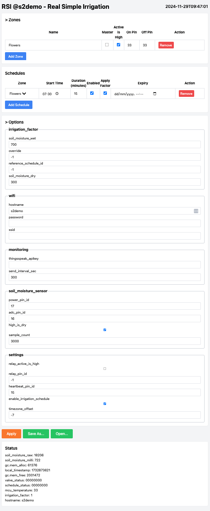

# RSI - Real Simple Irrigation



## Design Philosophy
1. Easy to source generic components
1. Cheap - cost could be as low as $10 (including the valve)
1. Easy to setup
    * Few components
    * No soldering required
1. Scheduled watering based on soil moisture

## UI

### Monitoring
Soil moisture, irrigation at 7:00 AM


# Hardware

## Diagram


[View Project on Wokwi](https://wokwi.com/projects/412802920651096065)

## Cost Breakdown
| Component | Spec | Cost |
| --- | --- | --- |
| Controller | ESP32-S2 | $2 |
| Soil moisture sensor | LM393 | $1 |
| Driver | L298N | $1.5 |
| Valve | 1/2" Solenoid 12V DC (Plastic) | $3.5 |
| Jumper wires | 10cm F-F | $0.5 |
| Power supply | 12V DC 1A | $1.5 |
| **Total** | | **$10** |

## Controller
This project is based on [ESP32-S2](https://www.espressif.com/en/products/socs/esp32-s2) + [MicroPython](https://docs.micropython.org/en/latest/esp32/quickref.html)

### Considerations for ESP32-S2
1. Built-in WiFi
1. [Lots of GPIOs](https://www.sudo.is/docs/esphome/boards/esp32s2mini/ESP32_S2_mini_pinout.jpg)
1. Easy to use - [Thonny (Python IDE)](https://thonny.org/)
1. Cheap

### Previous Iterations
1. Starting with a simple Digispark solution (Arduino based)
1. Followed by [WeAct RP2040](https://github.com/WeActStudio/WeActStudio.RP2040CoreBoard) + MicroPython - this solution lacked network connectivity
1. Raspberry Pi Zero W - bit of an overkill, there's no need for a full Linux system
1. [LOLIN D1 mini - ESP8266](https://www.wemos.cc/en/latest/d1/d1_mini.html) + MicroPython - too little memory (met limit on global strings)

## Valve / Pump

### Valves
1. [1/2" Solenoid 12V DC](https://www.google.com/search?q=12v+dc+solenoid+valve) normally closed means that without power the valve is closed.
1. DC Latching solenoid - Draws power only on state change [Bermad S-392T-2W](https://catalog.bermad.com/BERMAD%20Assets/Irrigation/Solenoids/IR-SOLENOID-S-392T-2W/IR_Accessories-Solenoid-S-392T-2W_Product-Page_English_2-2020_XSB.pdf)

### Pumps
1. DC pump - [12V DC pump](https://www.google.com/search?q=12v+dc+pump)

## Driver
Depends on the valve/pump used:
1. [Mechanical relays (Multi relay module)](https://www.google.com/search?q=Mechanical+multi+relay+module) - most versatile, compatible with AC, DC & reverse polarity
1. Solid state relays (Multi relay module) - compatible with DC only - no reverse polarity
1. [H-Bridge L298N](https://www.hibit.dev/posts/89/how-to-use-the-l298n-motor-driver-module) - for closing by reversing polarity

## Power Supply
Depends on the valve/pump used. The controller may be powered by a USB charger or VBUS pin.
Note: The H-Bridge L298N has an onboard 5V regulator which can be used to power the controller via the VBUS pin.

## Soil Moisture Sensor (Optional)
1. Build one based on a [10kΩ resistor](https://www.instructables.com/DIY-SOIL-MOISTURE-SENSOR-CHEAP-YET-ACCURATE-/)
    * Ground and VCC can be shared among multiple sensors.
    * You can use any type of probe, such as a nail or stainless steel wire.
1. Buy a [LM393](https://www.google.com/search?q=LM393) module

## Master Relay (Optional)
1. Saves power when waiting for the next watering cycle

# Software

## IoT Backend Options
1. [Thingspeak](https://thingspeak.com/) - [Video](https://www.youtube.com/watch?v=Ckf3zzCA5os)
1. [Blynk](https://blynk.io/) - [Video](https://www.youtube.com/watch?v=gCUyTRL9YRA)

## References
1. 

### Pinout
* [ESP8266 D1 Mini](https://www.sudo.is/docs/esphome/boards/esp8266d1mini/#pinout)
* [ESP32-S2 Mini](https://www.sudo.is/docs/esphome/boards/esp32s2mini/ESP32_S2_mini_pinout.jpg)
* [ESP32-S3](https://docs.espressif.com/projects/esp-idf/en/stable/esp32s3/_images/ESP32-S3_DevKitM-1_pinlayout.jpg) 

# Setup

## Initial Setup
1. Using Thonny, copy `main.py`, `index.html`, `setup.html` to the ESP32.
1. Reset & enter WiFi setup mode by pressing the button within 1 second. The LED will blink rapidly.
1. Connect to the ESP32's WiFi `irrigation-esp32` and configure the WiFi settings.

## Configuration

### UI


### Zones (Valves)
Each zone represents a valve or irrigation output that can be controlled independently. Configure the following fields:

1. **Name**: Descriptive name for the zone (e.g., "Front Yard", "Vegetable Garden")
1. **Master**: Check if this zone should act as a master valve that turns on before any other zone and turns off after all zones are done
1. **Active is High**: Check if the valve is activated when the GPIO pin is set to HIGH (unchecked means valve activates on LOW)
1. **On Pin**: GPIO pin number to turn the valve on (for latching valves, this is the "open" pin)
1. **Off Pin**: GPIO pin number to turn the valve off (for latching valves, this is the "close" pin; for regular valves, same as On Pin)
1. **Irrigation Factor Override**: Manual override for irrigation duration factor (-1 = use automatic calculation based on soil moisture)
1. **Soil Moisture Dry**: ADC reading value considered "dry" (irrigation starts below this value)
1. **Soil Moisture Wet**: ADC reading value considered "wet" (irrigation stops above this value)
1. **Soil Moisture ADC Pin**: GPIO pin connected to the analog output of the [soil moisture sensor](#soil-moisture-sensor-optional)
1. **Soil Moisture Power Pin**: GPIO pin used to power the soil moisture sensor (may be shared between zones as current is limited by a 10kΩ resistor)

### Schedules
Each schedule defines when and how a specific zone should be watered:

1. **Zone**: Select which zone this schedule controls (master zones cannot be scheduled directly)
1. **Start Time**: Time of day when irrigation should begin (24-hour format)
1. **Duration**: How long to run irrigation in minutes
1. **Enabled**: Check to enable this schedule (uncheck to temporarily disable without deleting)
1. **Weekdays**: Select which days of the week this schedule should run (M=Monday, T=Tuesday, W=Wednesday, T=Thursday, F=Friday, S=Saturday, S=Sunday)
1. **Use Soil Moisture Sensor**: Check to use soil moisture readings to determine if irrigation is needed
1. **Interval**: Pulsed irrigation (for germination / misting etc.) - time between pulse start to next pulse start in seconds (0 = continuous watering)
1. **Interval On**: Pulsed irrigation - how long each pulse should last in seconds
1. **Expiry**: Optional expiration date/time for temporary schedules (leave blank for permanent schedules)

#### Schedule actions
- **Pause Schedules**: Temporarily pause all scheduled irrigation for a specified number of hours
- **Ad-hoc Irrigation**: Manually trigger irrigation for a specific zone and duration in minutes (may be stopped by setting to 0)

### Options

#### wifi
1. **ssid**: Your WiFi SSID (network name) - leave empty to disable WiFi connection
1. **password**: Your WiFi password
1. **hostname**: The hostname of the controller for network identification (default: `rsi-` + last 3 MAC address bytes, e.g., `rsi-a1b2c3`). Allows connecting using hostname.local

#### monitoring
1. **thingsspeak_apikey**: ThingSpeak Write API key for sending telemetry data (leave empty to disable)
1. **send_interval_sec**: Interval in seconds between sending data to monitoring service (default: 300 seconds = 5 minutes)

#### soil_moisture_sensor
1. **high_is_dry**: Check if sensor reads high values when soil is dry (default: true for most sensors)
1. **sample_count**: Number of ADC readings to average for each soil moisture measurement (default: 3)

#### settings
1. **enable_irrigation_schedule**: Enable/disable all scheduled irrigation (default: true)
1. **timezone_offset**: Local timezone offset in hours from UTC (default: -7 for PDT/PST)
1. **relay_pin_id**: GPIO pin ID of the master relay that powers valve drivers (default: -1 = disabled)
1. **heartbeat_pin_id**: GPIO pin ID of the onboard LED for status indication (auto-detected based on board)
1. **relay_active_is_high**: Check if master relay activates when pin is HIGH (default: false)

#### log
1. **level**: Minimum log level to record (10=debug, 20=info, 30=warning, default: 20)
1. **max_lines**: Maximum number of log entries to keep in memory (default: 50)

#### fallback_time_sync
Advanced settings for time synchronization when NTP is unavailable (uses MCU temperature cycles):
1. **sync_days**: Number of days to monitor temperature patterns for time sync (default: 1)
1. **slices_per_day**: Number of temperature measurements per day (default: 48 = every 30 minutes)
1. **samples_per_slice**: Number of temperature readings per slice for averaging (default: 15)

### Configuration Actions
- **Apply**: Save the current configuration to the device
- **Save As**: Download the configuration as a JSON file for backup
- **Open**: Upload a previously saved configuration file

## Updating the Code
```shell
$ HOST=s2demo.local
$ for f in index.html setup.html main.py; do curl -X POST --data-binary @$f $HOST/file/$f | jq; done && curl -X PUT $HOST/reboot
$ curl ${HOST}/status | jq
```
